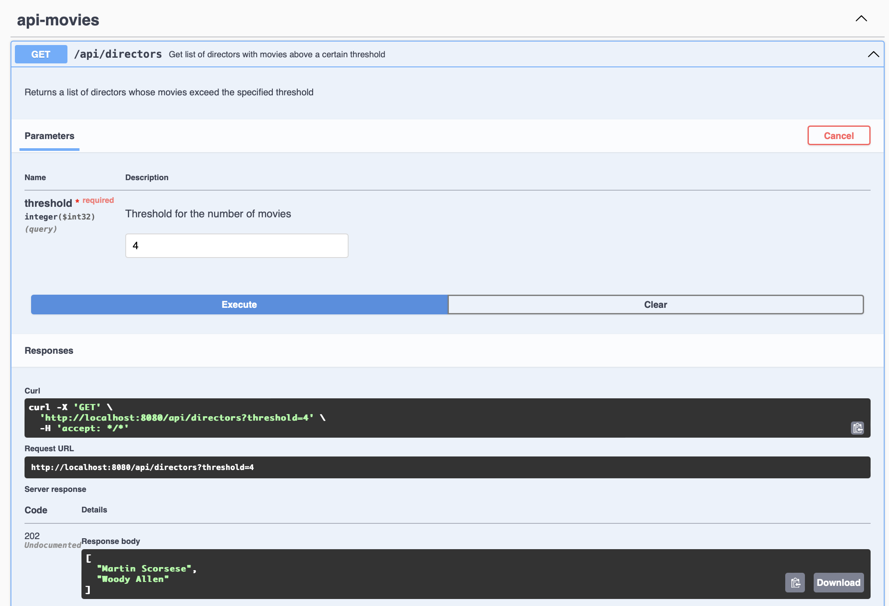

# README.md

## Project Setup and Requirements

This project is a Spring Boot application that uses Maven for dependency management and build automation. To run this project, you will need the following:

## Objectives of the Requirements

1. <span style="color:green">**Retrieve Movie Data**: [COMPLETED]</span>
    - Access the collection of movies released after 2010 directed by acclaimed directors.
    - Perform HTTP GET requests to the API endpoint to retrieve movie data.

2. <span style="color:green">**Parse API Response**: [COMPLETED]</span>
    - Parse the JSON response to extract relevant information including the current page, per_page, total, total_pages, and data fields.
    - Extract movie records from the data array, including details such as title, year, rated, released, runtime, genre, director, writer, and actors.

3. <span style="color:green">**Count Movies by Director**: [COMPLETED]</span>
    - Iterate through the movie data to count the number of movies directed by each director.
    - Store the count of movies for each director.

4. <span style="color:green">**Filter Directors by Threshold**: [COMPLETED]</span>
    - Identify directors who have directed more movies than the given threshold.
    - Create a list of directors whose movie count is strictly greater than the threshold value.

5. <span style="color:green">**Sort Directors Alphabetically**: [COMPLETED]</span>
    - Sort the list of directors' names in alphabetical order.

6. <span style="color:green">**Return Result**: [COMPLETED]</span>
    - Return the sorted list of directors' names as the final output.

7. <span style="color:green">**Implement `getDirectors` Function**: [COMPLETED]</span>
    - Complete the function `List<String> getDirectors(int threshold)` to fulfill the above objectives.

8. <span style="color:green">**Alternative Implementation (Spring Boot)**: [COMPLETED]</span>
    - Create a new Spring Boot project with a REST endpoint `/api/directors?threshold=<threshold>`.
    - Implement the functionality to retrieve, process, and return the list of directors as described above.
    - Share the solution via a .zip file or GitHub repository URL.


### Requirements
- **Java 17**: Ensure you have Java 17 installed. You can download it from the [official Oracle website](https://www.oracle.com/java/technologies/javase-jdk17-downloads.html) or use any preferred distribution.
- **Maven**: Make sure Maven is installed. You can download it from the [official Maven website](https://maven.apache.org/download.cgi).
- **Git**: You will need Git to clone the repository. You can download it from the [official Git website](https://git-scm.com/downloads).

### Cloning the Repository
To get started, you need to clone the repository. Open your terminal or command prompt and run the following command:

```bash
git clone https://github.com/risbo/d24movies.git

cd d24movies

mvn spring-boot:run
```
### Running the Tests
To run the tests for the application, use the following Maven command:

```bash
mvn test
```

### Swagger UI
You can access the Swagger UI for API documentation at the following URL:
```bash
http://localhost:8080/swagger-ui/index.html
```


This will provide you with an interactive interface to explore and test the API endpoints.

### API Endpoint

The API is exposed at http://localhost:8080/api/directors?threshold=4. This endpoint returns a list of directors whose movies exceed the specified threshold.

### Summary
- Ensure Java 17, Maven, and Git are installed.
- Clone the repository using Git.
- Navigate to the project directory and run the application using Maven.
- Access the API at http://localhost:8080/api/directors?threshold=4.
- Explore the API documentation at http://localhost:8080/swagger-ui/index.html.
